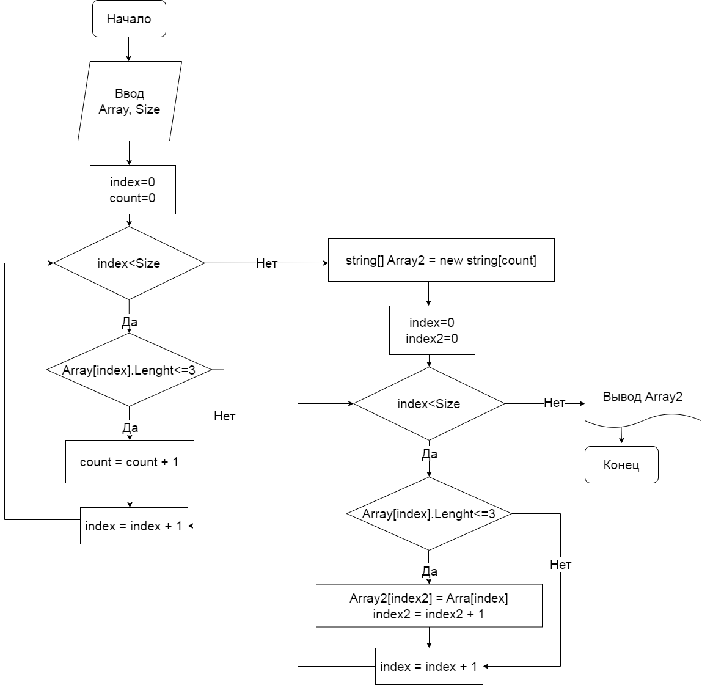
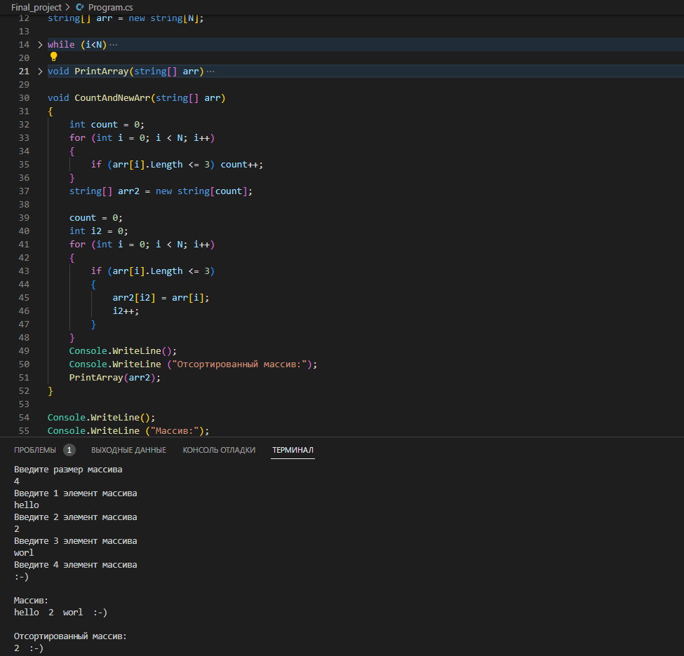

# Выбор специализации
## Итоговый проект

**Поставленные задачи:**

1) Создатьрепозиторий на GitHub
2) Нарисовать блок схему
3) Снабдить репозиторий оформленным описанием README.md
4) Написать программу, решающую поставленную задачу
5) Использовать контроль версии

**Задача:** Написать программу, которая из имеющегося массива строк формирует массив из строк, длина которых меньше либо равна 3 символам.

___

*Блок-схема задачи:*

*Пример запуска кода:*

